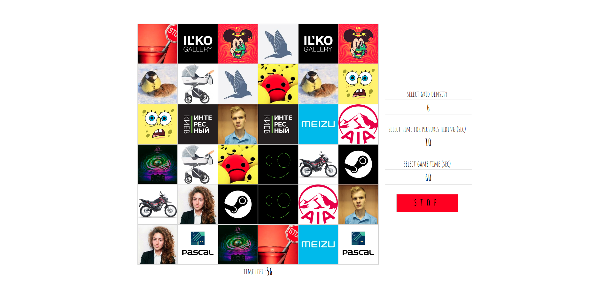

# Memory🤯Storm **2**

     

## What is this?   

Web game to improve Your attention, which make Your memory better and improve Your brain activity.    
When You start the game, You should memorize location of all pictures before their hiding.
After that, You can click on two blocks with hidden images.
If You select two equal images, You can keep on until they gone.
In a bad case, all pictures will be hidden again.

## Where can I play this?

You can play it [here](https://bringmetheaugust.github.io/projects/memory_storm) 👩🏻‍💻

## How can I deploy this?

 * run `yarn` to install all dependencies
 * run `yarn dev` and open Your http://localhost:2100
 
###### Required global packages:

 * *NodeJS v14.16.*\*
 * *yarn v1.22.*\*.

## Who made this?

August Luzanovsky, 2019
